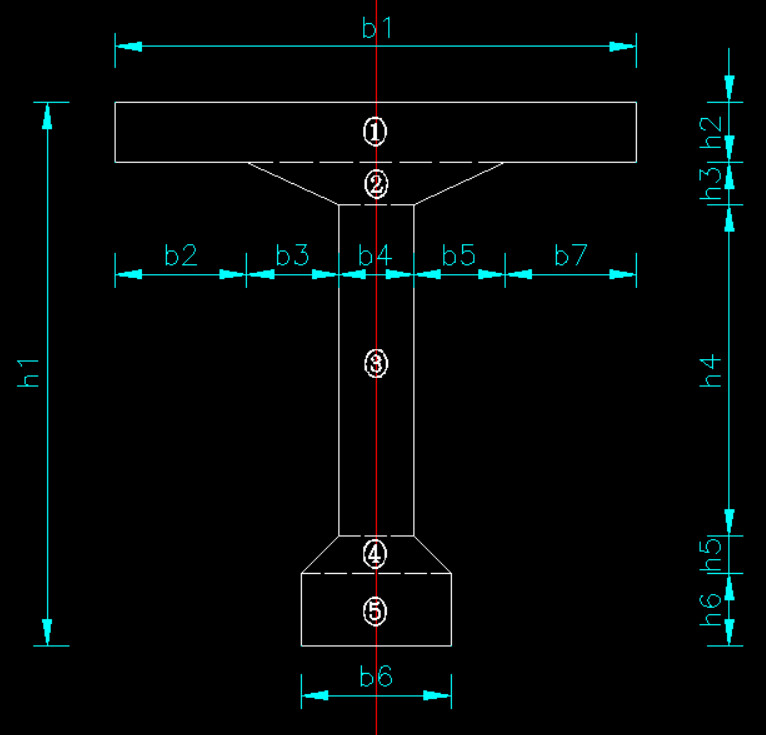
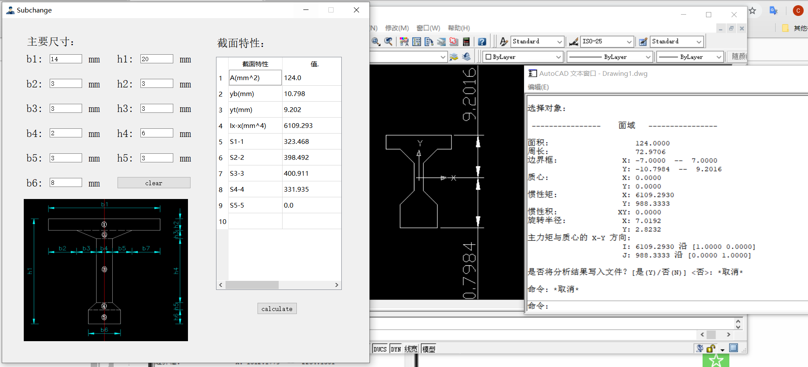
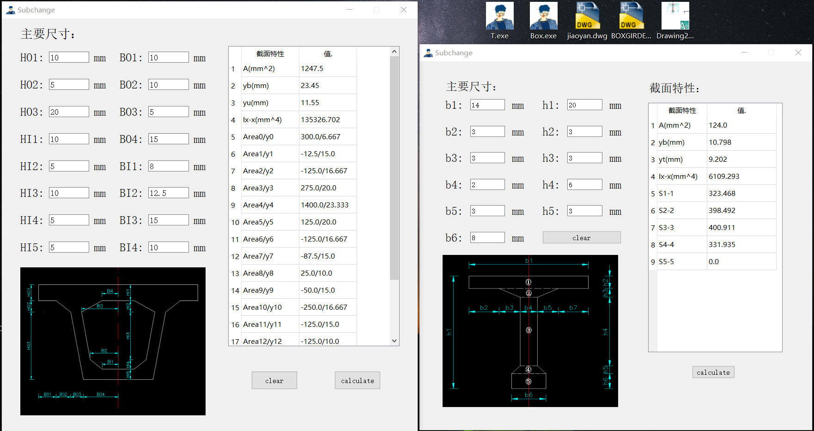

## Section characteristic calculator

Only to input the related parameters, you can get the Geometric properties of T section or Box section, including centroid and moment of interia.

* ## T section

  

  Result is as the follow:

  

* ## box section

Result is as the follow:

## Appendix:

